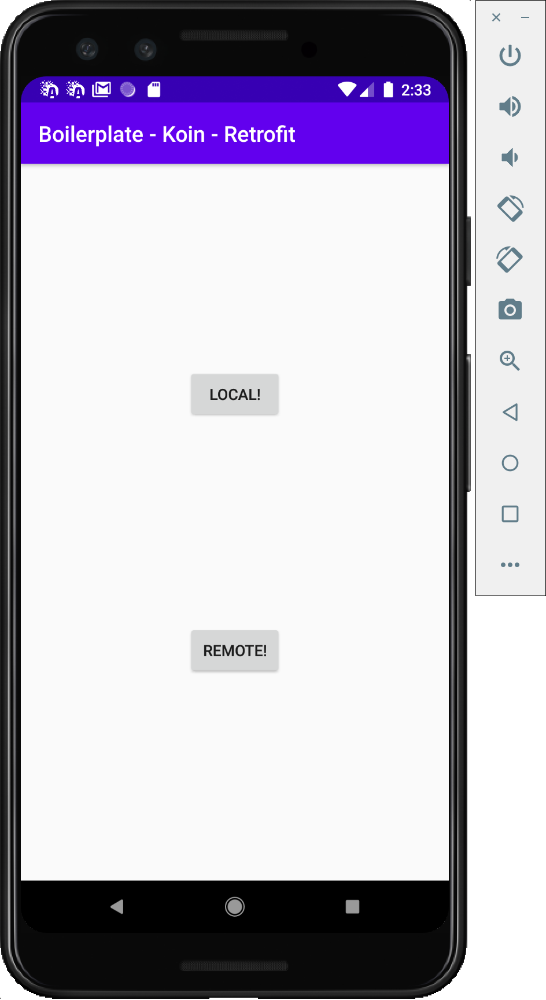

# Android Kotlin + Koin + Retrofit + Coroutines Boilerplate 🎉 🥰

Android Boilerplate project that use Kotlin, Koin, MVVM, Retrofit, OkHTTP and CoRoutines

It's a minimal, logicless boilerplate, clone it, code over it. Done.

Almost no extra code to remove.

